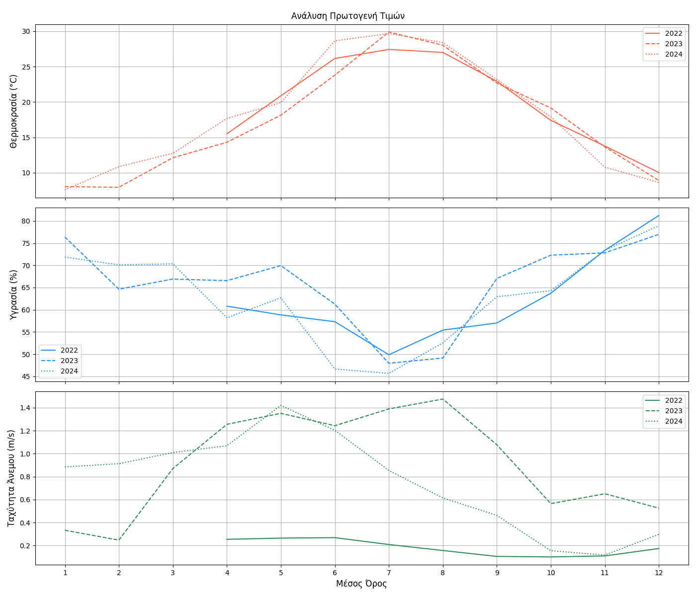
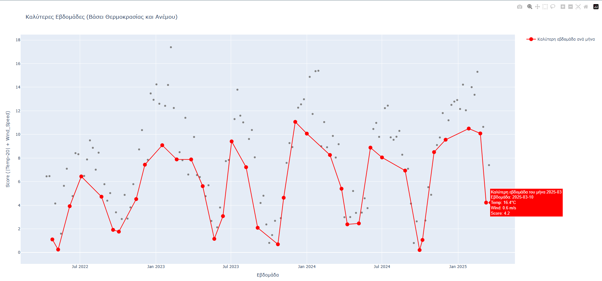

# Μετεωρολογία και Αγροκαλλιέργιες 
 Η παρούσα εργασία έχει ως στόχο τη μελέτη το καιρικών φαινομένων και πώς αυτές επιδρούν στις καλλιέργειες

 ## Πρωτογενής Τιμές
Με τη ομαδοποίηση των πρωτογεννών τιμών και τον υπολογισμό των μέσων τιμών της Θερμοκρασίας, της Ταχύτητας του ανέμου και της Υγρασίας, μπορούμε να αποκτήσουμε μια πιο κατανοητή εικόνα των μετεωρολογικών συνθηκών για κάθε μήνα και για κάθε έτος. Αυτή η διαδικασία μας επιτρέπει να εξάγουμε σημαντικά στατιστικά δεδομένα, τα οποία είναι απαραίτητα για την παρακολούθηση και ανάλυση των κλιματικών τάσεων.

Η ομαδοποίηση των δεδομένων κατά μήνα ή κατά έτος, καθώς και η σύγκριση των μέσων τιμών, βοηθά στην απομόνωση των εποχιακών ή ετήσιων διαφορών, επιτρέποντας την καλύτερη κατανόηση των παραμέτρων που επηρεάζουν το κλίμα ή τις κλιματικές συνθήκες της περιοχής. Επιπλέον, ο υπολογισμός αυτών των μέσων τιμών διευκολύνει την αναγνώριση προτύπων ή αποκλίσεων που θα μπορούσαν να υποδηλώνουν αλλαγές στο κλίμα ή άλλες περιβαλλοντικές τάσεις.
 
  
 Για την ανάδειξη των ευνοϊκότερων περιόδων από πλευράς καιρικών συνθηκών, τα δεδομένα ομαδοποιήθηκαν σε εβδομαδιαία βάση, επιτρέποντας την εξομάλυνση των ημερήσιων διακυμάνσεων και την αποκάλυψη πιο σταθερών εποχικών τάσεων. Στη συνέχεια, υπολογίστηκε για κάθε εβδομάδα ένας σύνθετος δείκτης (score), βασισμένος στην απόκλιση της θερμοκρασίας από την ιδανική τιμή των 20°C σε συνδυασμό με την ένταση του ανέμου. Η ομαδοποίηση σε μηνιαία σύνολα επέτρεψε την επιλογή της βέλτιστης εβδομάδας κάθε μήνα, προσφέροντας μια πιο στοχευμένη και πρακτική σύνοψη των κλιματικών συνθηκών. Αυτή η μεθοδολογία διευκολύνει την οπτικοποίηση της εποχικότητας και την εξαγωγή χρήσιμων συμπερασμάτων για δραστηριότητες που εξαρτώνται από τον καιρό.
  
  [Πήγαινε στη σελίδα Αρχική](127.0.0.1)
  
---
 ## 'Ωρες Ψύχους ανά μήνα
 Για κάθε χρονική περίοδο υπολογίστηκε το πλήθος των ωρών κατά τις οποίες η θερμοκρασία βρισκόταν κάτω από το όριο των 7,2°C, προσδιορίζοντας έτσι τις συνολικές ώρες ψύχους ανά έτος. Η συγκέντρωση αυτή επιτρέπει την χρονολογική παρακολούθηση της έντασης και διάρκειας τou ψύχους σε ετήσια βάση, αποκαλύπτοντας τυχόν διακυμάνσεις ή μακροπρόθεσμες τάσεις. Η μέθοδος αυτή προσφέρει μια ποσοτική αποτίμηση τou ψύχους, χρήσιμη τόσο για γεωργικές εφαρμογές, όπως ο υπολογισμός των αναγκών σε ψύχος για δενδροκαλλιέργειες, όσο και για την ευρύτερη παρακολούθηση των κλιματικών μεταβολών που ενδέχεται να επηρεάσουν την τοπική παραγωγή και οικολογία. Οι τιμές αυτές καταχωρήθηκαν τόσο σε ετήσια όσο και σε μηνιαία βάση, επιτρέποντας τη λεπτομερή παρακολούθηση της ψυχρής περιόδου μέσα στον χρόνο. 
 
 

 

 ---
 ## Κατάλληλες Περίοδοι για Σπορά και Ψεκασμό

 ---
 ## Συσσώρευση Βλάστησης        
Το γράφημα παρουσιάζει την εξέλιξη των Θερμομονάδων Ανάπτυξης (GDD) κατά τη διάρκεια της καλλιεργητικής περιόδου. Παρατηρείται σταδιακή αύξηση των GDD καθώς προχωρούν οι μήνες, γεγονός που αντικατοπτρίζει τη συσσώρευση θερμότητας απαραίτητης για την ανάπτυξη των φυτών. Οι περίοδοι με υψηλότερες τιμές GDD υποδεικνύουν ευνοϊκές συνθήκες για την επιτάχυνση της ανάπτυξης, ενώ οι χαμηλότερες τιμές, κυρίως στην αρχή και στο τέλος της σεζόν, δείχνουν περιορισμένη δραστηριότητα. Το γράφημα αυτό αποτελεί χρήσιμο εργαλείο για τον προγραμματισμό γεωργικών εργασιών και την εκτίμηση της φαινολογικής εξέλιξης της καλλιέργειας.

Το PET (Potential Evapotranspiration – Δυναμική Εξάτμιση και Διαπνοή) είναι μια κρίσιμη παράμετρος στις αγροκαλλιέργειες, καθώς εκτιμά τη μέγιστη ποσότητα νερού που μπορεί να χαθεί από το έδαφος και τα φυτά μέσω εξάτμισης και διαπνοής, όταν υπάρχει άφθονο νερό διαθέσιμο. Αποτελεί δείκτη της υδατικής ζήτησης της καλλιέργειας υπό ιδανικές συνθήκες. Η παρακολούθηση του PET βοηθά τους γεωπόνους και τους αγρότες να προγραμματίζουν σωστά την άρδευση, αποφεύγοντας τόσο την υπερβολική όσο και την ανεπαρκή παροχή νερού. Υπολογίζεται με βάση κλιματικά δεδομένα όπως η θερμοκρασία, η ηλιακή ακτινοβολία, η υγρασία και ο άνεμος.

 
 

 ---
