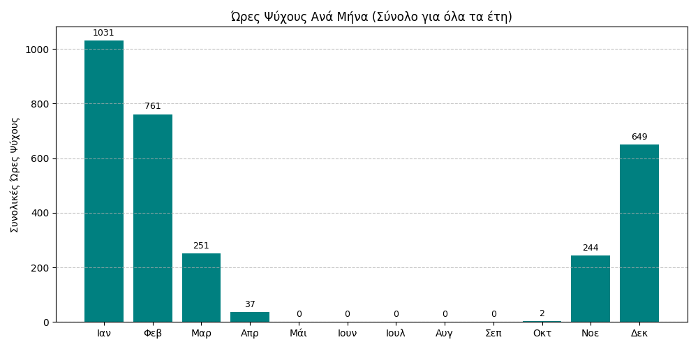
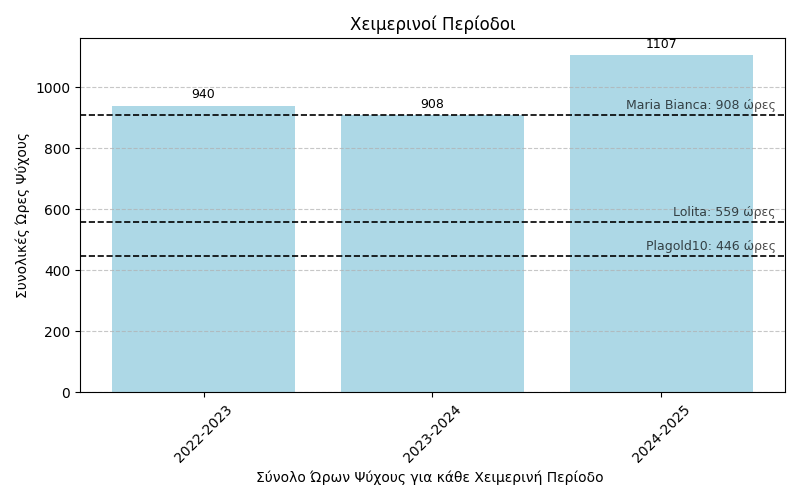

# Ανάλυση Μετεωρολογικών Δεδομένων για Καλλιέργειες Ροδάκινων 

ΕΦΑΡΜΟΓΕΣ ΨΗΦΙΑΚΩΝ ΣΥΣΤΗΜΑΤΩΝ ΣΤΟ ΠΕΡΙΒΑΛΛΟΝ 
  Τσιβελεΐδης Βαλέριος Χατζηνικολάου Δημήτριος-Φώτης  

## ΕΙΣΑΓΩΓΗ
Οι αγρότες και οι καλλιέργειες αντιμετωπίζουν μια σειρά από σημαντικά προβλήματα που επηρεάζουν την παραγωγικότητα και τη βιωσιμότητά τους. Οι έντονες κλιματικές μεταβολές και τα ακραία καιρικά φαινόμενα,  προκαλούν σοβαρές ζημιές στις σοδειές και δυσκολεύουν τον προγραμματισμό των αγροτικών εργασιών.Παράλληλα, η έλλειψη επαρκούς νερού για άρδευση, καθώς και η άγνοια της κατάλληλης χρονικής στιγμής για τις γεωργικές διεργασίες, αποτελούν κρίσιμα ζητήματα για τους αγρότες.

Η παρούσα εργασία ασχολείται με τη μελέτη των καιρικών συνθήκων στην Λάρισα και της επίδρασής τους σε γεωργικές εφαρμογές. Τα δεδομένα αντλήθηκαν από το [μετεωρολογικό σταθμό](https://greendigital.uth.gr/gr/weather/) του Τμήματος [Ψηφιακών Συστημάτων](https://ds.uth.gr/) του Πανεπιστημίου Θεσσαλίας. Οι μετρήσεις αυτές περιλαμβάνουν τα παρακάτω μεγέθη:

- Θερμοκρασία
- Σχετική υγρασία του αέρα
- Ταχύτητα του ανέμου
- Ύψος βροχής

από τα οποία εξάγονται δείκτες και δευτερογενείς τιμές που χαρακτηρίζουν τη βιωσιμότητα των καλλιεργειών.

Τελικός στόχος της εργασίας είναι να διερευνήσει πώς οι συγκεκριμένες μετρήσεις μπορούν να αξιοποιηθούν για τη δημιουργία συνθηκών και να μελετηθούν κρίσιμοι παράμετροι που επιδρούν στο κλίμα και στις καλλιέργειες ροδάκινων,όπως:
 * Τις ώρες ψύχους 
 * Τις κατάλληλες περιόδους για σπορά και ψεκασμό στις καλλιέργειες
 * Τη συσσώρευση βλάστησης στις καλλιέργειες  (GDD)
 * Τη μεταβολή της εξατμισό-διαπνοής των φυτών  (PET)
   
 καθώς και για τον προσδιορισμό μελλοντικών προβλέψεων, όπως:
 
* Τη μεταβολή  της υγρασίας του εδάφους σχετικά με το PET για να πραγματοποιηθεί η σπορά και ο ψεκασμός των ροδάκινων
* Τον υπολογισμό  του PET σχετικά με την καταλληλότητα κάθε ποικιλίας ροδάκινων
  
  οι οποίες καθορίζουν τις κατάλληλες στιγμές που μπορεί να πραγματοποιηθούν οι παραπάνω εργασίες

 Με τη παρακολούθηση των κλιματικών μεταβολών και των επιπτώσεών τους στις καλλιέργειες. Μέσω της ανάλυσης αυτών των δεδομένων, στοχεύουμε στη βελτιστοποίηση των γεωργικών διαδικασιών και στην κατανόηση των τάσεων που ανακύπτουν από τις καιρικές συνθήκες, προκειμένου να δώσουμε αξία σε πρακτικές εφαρμογές και να επιτύχουμε αποτελεσματική διαχείριση των φυσικών πόρων.

 ## Πρωτογενή Δεδομένα
Με την ομαδοποίηση των πρωτογενών τιμών και τον υπολογισμό των μέσων τιμών :
 * της θερμοκρασίας
 * της ταχύτητας του ανέμου
 * της υγρασίας
 
μπορούμε να αποκτήσουμε μια πιο κατανοητή εικόνα των μετεωρολογικών συνθηκών για κάθε μήνα και για κάθε έτος. Αυτή η διαδικασία μας επιτρέπει να εξάγουμε σημαντικά στατιστικά δεδομένα, τα οποία είναι απαραίτητα για την παρακολούθηση και ανάλυση των κλιματικών τάσεων.
 
 Η ομαδοποίηση των δεδομένων γίνεται κατά μήνα και έτος, καθώς και η σύγκριση των μέσων τιμών, βοηθά στην απομόνωση των εποχιακών ή ετήσιων διαφορών. Επιπλέον, ο υπολογισμός αυτών των μέσων τιμών διευκολύνει την αναγνώριση προτύπων ή αποκλίσεων που ενδέχεται να υποδηλώνουν αλλαγές στο κλίμα ή άλλες περιβαλλοντικές τάσεις.
 
  
Χρησιμοποιώντας τα πρωτογενή δεδομένα εφαρμόσαμε το τύπο του δείκτη δυσφορίας ( Discomfort Index), έναν αριθμητικό δείκτη που μας δείχνει βάση της υγρασίας και της θερμοκρασίας, πόσο ενοχλητική είναι η ζέστη για το σώμα μας.

$$
DI = T - [0.55 \cdot (1 - 0.01 \cdot RH) \cdot (T - 14.5)]
$$

Όπου:
- **DI** = Δείκτης Δυσφορίας (σε °C)
- **T** = Μέση θερμοκρασία αέρα (σε °C)  
- **RH** = Μέση σχετική υγρασία (σε %)

  Με την ανάλυση των μετεωρολογικών δεδομένων κατά τη περίοδο 2022-2025 μπορούμε να εξάγουμε χρήσιμα δευτερογενή δεδομένα σχετικά με το δείκτη δυσφορίας. Η ομαδοποίηση των δεδομένων ανά ημέρα και η επιλογή της χειρότερης ημέρας για κάθε μήνα για όλα τα έτη, προσφέρει μια πιο στοχασμένη πρακτική σύνοψη των κλιματικών συνθηκών που επικρατούν και μπορείτε να τη [δείτε εδώ](https://mromg333.github.io/meteo/Link/diagrama_di.html
) και συμβάλουν ουσιαστικά στην αξιολόγηση των επιπτώσεων της θερμοκρασίας και της υγρασίας στην ανθρώπινη άνεση και στις αγροτικές εργασίες.

[^7]
## 'Ωρες Ψύχους ανά μήνα

 Για κάθε μήνα κάθε έτους υπολογίστηκε το πλήθος των ωρών κατά τις οποίες η θερμοκρασία βρισκόταν κάτω από το όριο των 7,2°C κρίσιμες ώρες οι οποίες προσδιορίζουν την ανάπτυξη των φυτών και στη περίπτωση μας τη καλλιέργεια ροδακινιών.

 
  
 Στη συνέχεια, συγκεντρώθηκαν οι ώρες ψύχους για κάθε χειμερινή περίοδο κάθε χρόνου, επιτρέποντας τη λεπτομερή παρακολούθηση της ψυχρής περιόδου μέσα στα χρόνια.
 Η συγκέντρωση αυτή επιτρέπει τη χρονολογική παρακολούθηση της έντασης και της διάρκειας του ψύχους, αποκαλύπτοντας τυχόν διακυμάνσεις ή μακροπρόθεσμες τάσεις. Η μέθοδος αυτή προσφέρει μια ποσοτική αποτίμηση του ψύχους, χρήσιμη τόσο για γεωργικές εφαρμογές, όπως ο υπολογισμός των αναγκών σε ψύχος για δέντρο καλλιέργειες ροδάκινων, όσο και για την ευρύτερη παρακολούθηση των κλιματικών μεταβολών που ενδέχεται να επηρεάσουν την τοπική παραγωγή και οικολογία.

 
 
 Με βάση τα όρια ψύχους που μπορεί να επικρατήσει και να ευδοκιμήσει κάθε μία απο τις παρακάτω ποικιλίες ροδάκινων μπορούμε να καταλάβουμε εάν είναι εύκρατες στην περιοχή της Λάρισας, όπου και συγκεντρώθηκαν οι παραπάνω ώρες ψύχους για κάθε χρονική περίοδο.  
| Ποικιλίες Ροδάκινων   |Ώρες Ψύχους (0-7,2°C) που χρειάζονται|
|------------------------|-----------------------|
| Maria Bianca           |	908                   |
| Lolita                 |559                    |
|Plagold10               |446                    |

[^1] 

 
 ## Κατάλληλες Περίοδοι για Σπορά και Ψεκασμό
 
Η ανάλυση για την κατάλληλη περίοδο σποράς και ψεκασμού βασίζεται σε διάφορους παράγοντες, όπως η θερμοκρασία του αέρα, η υγρασία και η υγρασία του εδάφους. 
Για τη σπορά, θεωρούνται κατάλληλες οι ημέρες όταν:
* η υγρασία εδάφους κυμαίνεται μεταξύ 40% και 75%
* η θερμοκρασία είναι μεταξύ 10°C και 28°C
* η υγρασία του αέρα ξεπερνά το 35%

Αντίστοιχα, για τον ψεκασμό :
* η υγρασία εδάφους πρέπει να είναι κάτω από 70%
* η ταχύτητα του ανέμου μικρότερη από 6 m/s
* η υγρασία του αέρα πάνω από 35%

Χρησιμοποιώντας αυτά τα κριτήρια, υπολογίζονται οι κατάλληλες ημέρες για σπορά και ψεκασμό.

Τα αποτελέσματα αναφέρουν για κάθε μήνα και έτος τον αριθμό των ημερών που πληρούν τις συνθήκες για την εκτέλεση αυτών των δραστηριοτήτων. Αυτή η ανάλυση είναι καθοριστική για την αποδοτική διαχείριση των γεωργικών εργασιών, εξασφαλίζοντας τη μέγιστη αποτελεσματικότητα στις καλλιέργειες και τους ψεκασμούς, βασισμένη στις επικρατούσες κλιματικές συνθήκες.

 ## Συσσώρευση Βλάστησης      
 
Το παρακάτω γράφημα παρουσιάζει την εξέλιξη των Θερμομονάδων Ανάπτυξης (GDD) κατά τη διάρκεια της καλλιεργητικής περιόδου. Παρατηρείται σταδιακή αύξηση των GDD καθώς προχωρούν οι μήνες, γεγονός που αντικατοπτρίζει τη συσσώρευση θερμότητας, απαραίτητης για την ανάπτυξη των φυτών.

Οι περίοδοι με υψηλότερες τιμές GDD υποδεικνύουν ευνοϊκές συνθήκες για την επιτάχυνση της ανάπτυξης, ενώ οι χαμηλότερες τιμές, κυρίως στην αρχή και στο τέλος της σεζόν, δείχνουν περιορισμένη δραστηριότητα. Το γράφημα αυτό αποτελεί χρήσιμο εργαλείο για τον προγραμματισμό γεωργικών εργασιών και την εκτίμηση της φαινολογικής εξέλιξης της καλλιέργειας και υπολογίζεται ως εξής:

$$
\text{GDD} = \frac{T_\text{max} + T_\text{min}}{2} - T_\text{base}
$$

Όπου:
- $\text{GDD}$: οι Θερμομονάδες Ανάπτυξης ,
- $T_\text{max}$: η μέγιστη ημερήσια θερμοκρασία (°C),
- $T_\text{min}$: η ελάχιστη ημερήσια θερμοκρασία (°C),
- $T_\text{base}$: η βασική θερμοκρασία ανάπτυξης του φυτού (°C).

[^2]

Το PET (Potential Evapotranspiration – Δυναμική Εξάτμιση και Διαπνοή) είναι μια κρίσιμη παράμετρος στις αγροκαλλιέργειες, καθώς εκτιμά τη μέγιστη ποσότητα νερού που μπορεί να χαθεί από το έδαφος και τα φυτά μέσω εξάτμισης και διαπνοής, όταν υπάρχει άφθονο διαθέσιμο νερό. Αποτελεί δείκτη της υδατικής ζήτησης της καλλιέργειας υπό ιδανικές συνθήκες.

Η παρακολούθηση του PET βοηθά γεωπόνους και αγρότες να προγραμματίζουν σωστά την άρδευση, αποφεύγοντας τόσο την υπερβολική όσο και την ανεπαρκή παροχή νερού. Υπολογίζεται με βάση κλιματικά δεδομένα, όπως η θερμοκρασία, η ηλιακή ακτινοβολία, η υγρασία, ο άνεμος και το βαρομετρικό υψόμετρο.

$$
PET= \frac{0.408 \, \Delta (R_n - G) + \gamma \, \frac{900}{T + 273} \, u_2 \, (e_s - e_a)}{\Delta + \gamma \, (1 + 0.34 \, u_2)}
$$

όπου:

- $PET$: Δυνητική εξατμισοδιαπνοή (mm/ημέρα)  
- $\Delta$: Κλίση της καμπύλης πίεσης κορεσμού υδρατμών (kPa/°C)  
- $R_n$: Καθαρή ακτινοβολία στην επιφάνεια (MJ/m²/ημέρα)  
- $G$: Ροή θερμότητας στο έδαφος (MJ/m²/ημέρα), συνήθως ≈ 0 για ημερήσιες μετρήσεις  
- $\gamma$: Ψυχομετρική σταθερά (kPa/°C)  
- $T$: Μέση ημερήσια θερμοκρασία αέρα (°C)  
- $u_2$: Ταχύτητα ανέμου στα 2 μέτρα ύψος (m/s)  
- $e_s$: Πίεση κορεσμού υδρατμών (kPa)  
- $e_a$: Πραγματική πίεση υδρατμών (kPa)  
- $e_s - e_a$: Έλλειμμα πίεσης υδρατμών (kPa), που σχετίζεται με το πόσο ξηρός είναι ο αέρας  

[^3]

 
 

## Προβλέψεις για Σπορά και Ψεκασμό
Με τη βοήθεια μελλοντικών προβλέψεων για τις μετρήσεις θερμοκρασίας, ταχύτητας ανέμου, σχετικής υγρασίας και βροχόπτωσης, μπορούμε να καθορίσουμε τις κατάλληλες ώρες για να πραγματοποιηθεί η σπορά και ο ψεκασμός των καλλιεργειών.

Συγκεκριμένα, για κάθε μία από τις εικονιζόμενες ποικιλίες ροδακινιών υπολογίζεται η υγρασία του εδάφους με βάση τον παρακάτω τύπο:
Δεν λαμβάνεται υπόψη η απορρόφηση του νερού από τον αειφόρο ορίζοντα.

Για κάθε ποικιλία χρησιμοποιήθηκαν λογικές αποδοχές — δηλαδή τιμές που δείχνουν τις κατάλληλες συνθήκες, βάσει θερμοκρασίας, υγρασίας και ταχύτητας του ανέμου — στις οποίες μπορεί να πραγματοποιηθεί αποδοτικά ο ψεκασμός και η σπορά.

Με βάση αυτές τις αποδοχές και την τρέχουσα υγρασία του εδάφους, μπορούμε να προσδιορίσουμε κατά πόσο οι συνθήκες είναι κατάλληλες για να προχωρήσουν οι γεωργικές εργασίες.

 $$
\Delta S = P - PET
$$
- **ΔS**:Μεταβολή της υγρασίας του εδάφους (mm),
- **P**:Βροχόπτωση (mm),
- **PET**: Δυνητική εξατμισοδιαπνοή σε χιλιοστά (mm)([αναλύεται παραπάνω](#Συσσώρευση-Βλάστησης)).
 
[^4]

 

[^6] [^5][^4] [^3] [^2] [^1]
## Προβλέψεις για το PET
Με τη λήψη μετρήσεων από δεδομένα προβλέψεων μπορούμε να υπολογίσουμε την τιμή της Δυνητικής Εξατμισοδιαπνοής (PET).

Για κάθε μία ποικιλία ροδακινιών χρησιμοποιούνται λογικές αποδοχές για την καταλληλότητα του PET, δηλαδή τιμές που υποδηλώνουν την ιδανική τιμή του PET για κάθε ποικιλία. 

Με αυτόν τον τρόπο μπορούμε να καθορίσουμε την καταλληλότητα των συνθηκών για την ανάπτυξη της κάθε ποικιλίας, εντοπίζοντας τις ώρες κατά τις οποίες το PET βρίσκεται εντός των βέλτιστων ορίων και επομένως οι συνθήκες είναι ευνοϊκές για την καλλιέργεια.

Από αυτόν τον [τύπο του PET](#Συσσώρευση-Βλάστησης), εμείς χρησιμοποιούμε έναν πιο απλουστευμένο, λόγω έλλειψης τιμών.
Τα στοιχεία που χρησιμοποιούμε 

είναι:

*   Η μέση θερμοκρασία του αέρα (°C)
*   Η ταχύτητα του ανέμου (m/s)
*   H καθαρή ακτινοβολία (MJ/m²/h)
*   Η σχετική υγρασία (%)
*   Το υψόμετρο (m)
*   Την ατμοσφαιρική πίεση (kPa)

          
## Ευχαριστίες και Καταμερισμός της εργασίας
Σε αυτό  το σημείο θα θέλαμε να εκφράσουμε τις θερμές μας ευχαριστίες στον επιβλέποντα καθηγητή μας, κ. Χαραλάμπους Ονούφριο , για την πολύτιμη καθοδήγηση, την υποστήριξη και τις χρήσιμες παρατηρήσεις του καθ’ όλη τη διάρκεια της εκπόνησης της παρούσας εργασίας καθώς και για την παροχή  των μετεωρολογικών  δεδομένων. 
  Ο καταμερισμός της εργασίας ανά κεφάλαιο έγινε ως εξής: 
  [ΚΕΦΑΛΑΙΟ 1: Πρωτογενή Δεδομένα:](#Πρωτογενή-Δεδομένα) Χατζηνικολάου Δημήτριος 
  [ΚΕΦΑΛΑΙΟ 2:'Ωρες Ψύχους ανά μήνα:](#'Ωρες-Ψύχους-ανά-μήνα) Τσιβελεΐδης Βαλέριος & Χατζηνικολάου Δημήτριος 
  [ΚΕΦΑΛΑΙΟ 3: Κατάλληλες Περίοδοι για Σπορά και Ψεκασμό:](#Κατάλληλες-Περίοδοι-για-Σπορά-και-Ψεκασμό) Τσιβελεΐδης Βαλέριος 
  [ΚΕΦΑΛΑΙΟ 4: Προβλέψεις για Σπορά και Ψεκασμό:](#Προβλέψεις-για-Σπορά-και-Ψεκσασμό)  Τσιβελεΐδης Βαλέριος 
  [ΚΕΦΑΛΑΙΟ 5: Συσσώρευση Βλάστησης:](#Συσσώρευση-Βλάστησης) Τσιβελεΐδης Βαλέριος 
 [ΚΕΦΑΛΑΙΟ 6: Προβλέψεις για το PET:](#Προβλέψεις-για-το-PET)  Τσιβελεΐδης Βαλέριος  
  Συγγραφή εργασίας σε Markdown: Χατζηνικολάου Δημήτριος 
  Η εργασία υλοποιήθηκε με τη γλώσσα προγραμματισμού Python με βοήθεια των παρακάτω βιβλιοθηκών:
* Νumpy
* Pandas
* Matplot
* Sys
* Pyet
* Pyeto
*  

### Βιβλιογραφία
 [^1]: [Ποικιλίες ροδακίνων](https://www.farm.novagreen.gr/ores-psychoys-chilling-hours/)
 [^2]: [GDD](https://en.wikipedia.org/wiki/Growing_degree-day)
 [^3]: [PET](https://en.wikipedia.org/wiki/Penman%E2%80%93Monteith_equation)
 [^4]: [Soil_Moisture 1](https://en.wikipedia.org/wiki/Thornthwaite_climate_classification)
 [^5]: [Soil_Moisture 2](http://www.gaiapedia.gr/gaiapedia/index.php/%CE%A5%CE%B3%CF%81%CE%B1%CF%83%CE%AF%CE%B1_%CE%B5%CE%B4%CE%AC%CF%86%CE%BF%CF%85%CF%82)
 [^6]: [Growing-Spraying Requirements](https://extension.usu.edu/yardandgarden/research/peaches-in-the-garden)
  [^7]: [Discomfort_Index](https://www.jeeng.net/pdf-144092-70092?filename=Heat+Stress+Analysis.pdf)

