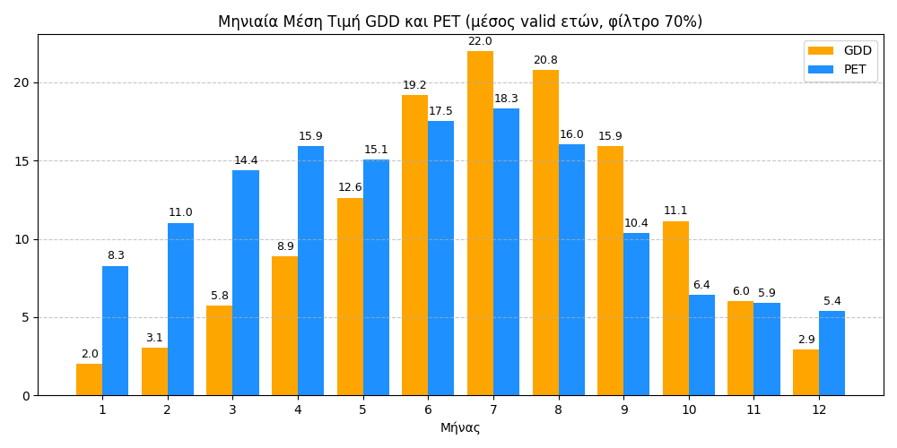

# Μετεωρολογία και Αγροκαλλιέργιες 
 Η παρούσα εργασία έχει ως στόχο τη μελέτη το καιρικών φαινομένων και πώς αυτές επιδρούν στις καλλιέργειες

 ## Πρωτογενής Τιμές
Με τη ομαδοποίηση των πρωτογεννών τιμών και τον υπολογισμό των μέσων τιμών της Θερμοκρασίας, της Ταχύτητας του ανέμου και της Υγρασίας, μπορούμε να αποκτήσουμε μια πιο κατανοητή εικόνα των μετεωρολογικών συνθηκών για κάθε μήνα και για κάθε έτος. Αυτή η διαδικασία μας επιτρέπει να εξάγουμε σημαντικά στατιστικά δεδομένα, τα οποία είναι απαραίτητα για την παρακολούθηση και ανάλυση των κλιματικών τάσεων.

Η ομαδοποίηση των δεδομένων κατά μήνα ή κατά έτος, καθώς και η σύγκριση των μέσων τιμών, βοηθά στην απομόνωση των εποχιακών ή ετήσιων διαφορών, επιτρέποντας την καλύτερη κατανόηση των παραμέτρων που επηρεάζουν το κλίμα ή τις κλιματικές συνθήκες της περιοχής. Επιπλέον, ο υπολογισμός αυτών των μέσων τιμών διευκολύνει την αναγνώριση προτύπων ή αποκλίσεων που θα μπορούσαν να υποδηλώνουν αλλαγές στο κλίμα ή άλλες περιβαλλοντικές τάσεις.
 
 
---
 ## 'Ωρες Ψύχους ανά μήνα
 Συνολικές ώρες ψύχους που παρατηρήθηκαν κατά τη διάρεκια του 2022-2025 
 
 

 ---
 ## Κατάλληλες Περίοδοι για Σπορά και Ψεκασμό

 ---
 ## Συσσώρευση Βλάστησης        
Το γράφημα παρουσιάζει την εξέλιξη των Θερμομονάδων Ανάπτυξης (GDD) κατά τη διάρκεια της καλλιεργητικής περιόδου. Παρατηρείται σταδιακή αύξηση των GDD καθώς προχωρούν οι μήνες, γεγονός που αντικατοπτρίζει τη συσσώρευση θερμότητας απαραίτητης για την ανάπτυξη των φυτών. Οι περίοδοι με υψηλότερες τιμές GDD υποδεικνύουν ευνοϊκές συνθήκες για την επιτάχυνση της ανάπτυξης, ενώ οι χαμηλότερες τιμές, κυρίως στην αρχή και στο τέλος της σεζόν, δείχνουν περιορισμένη δραστηριότητα. Το γράφημα αυτό αποτελεί χρήσιμο εργαλείο για τον προγραμματισμό γεωργικών εργασιών και την εκτίμηση της φαινολογικής εξέλιξης της καλλιέργειας.  
 

 ---
