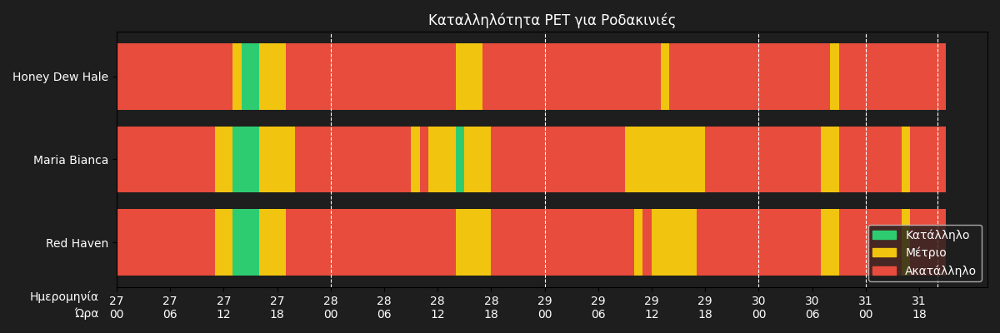

# Μετεωρολογία και Αγροκαλλιέργιες Ροδάκινων 

## ΕΙΣΑΓΩΓΗ 

Η παρούσα εργασία ασχολείται με τη μελέτη των καιρικών συνθήκων στην Λάρισα και της επίδρασής τους σε γεωργικές εφαρμογές. Τα δεδομένα αντλήθηκαν από το [μετεωρολογικό σταθμό](https://greendigital.uth.gr/gr/weather/) του Τμήματος [Ψηφιακών Συστημάτων](https://ds.uth.gr/) του Πανεπιστημίου Θεσσαλίας. Οι μετρήσεις αυτές περιλαμβάνουν τα παρακάτω μεγέθη:

- Θερμοκρασία
- Σχετική υγρασία του αέρα
- Ταχύτητα του ανέμου
- Ύψος βροχής

οποία εξάγωνται δεικτές που χαρακτηρίζουν τη βιωσιμότητα των καλλιεργειών.

Τελικός στόχος της εργασίας είναι να εξετάσει πώς αυτές οι μετρήσεις μπορούν να χρησιμοποιηθούν για τη μέτρηση παλαιών παραμέτρων, καθώς και για τον προσδιορισμό μελλοντικών προβλέψεων, όπως:
 * Ώρες Ψύχους
 * οι κατάλληλες περίοδοι για σπορά και ψεκασμό
 * Συσσώρευση Βλάστησης (GDD & PET)

 τη παρακολούθηση των κλιματικών μεταβολών και των επιπτώσεών τους στις καλλιέργειες. Μέσω της ανάλυσης αυτών των δεδομένων, στοχεύουμε στη βελτιστοποίηση των γεωργικών διαδικασιών και στην κατανόηση των τάσεων που ανακύπτουν από τις καιρικές συνθήκες, προκειμένου να δώσουμε αξία σε πρακτικές εφαρμογές και να επιτύχουμε αποτελεσματική διαχείριση των φυσικών πόρων.

 ## Πρωτογενή Δεδομένα
Με την ομαδοποίηση των πρωτογενών τιμών και τον υπολογισμό των μέσων τιμών :
 * της θερμοκρασίας
 * της ταχύτητας του ανέμου
 * της υγρασίας
 
μπορούμε να αποκτήσουμε μια πιο κατανοητή εικόνα των μετεωρολογικών συνθηκών για κάθε μήνα και για κάθε έτος. Αυτή η διαδικασία μας επιτρέπει να εξάγουμε σημαντικά στατιστικά δεδομένα, τα οποία είναι απαραίτητα για την παρακολούθηση και ανάλυση των κλιματικών τάσεων.
 

Η ομαδοποίηση των δεδομένων γίνεται κατά μέρα,μήνα ή έτος, καθώς και η σύγκριση των μέσων τιμών, βοηθά στην απομόνωση των εποχιακών ή ετήσιων διαφορών, επιτρέποντας την καλύτερη κατανόηση των παραμέτρων που επηρεάζουν το κλίμα ή τις κλιματικές συνθήκες της περιοχής. Επιπλέον, ο υπολογισμός αυτών των μέσων τιμών διευκολύνει την αναγνώριση προτύπων ή αποκλίσεων που ενδέχεται να υποδηλώνουν αλλαγές στο κλίμα ή άλλες περιβαλλοντικές τάσεις.
 
  
Για την ανάδειξη των ευνοϊκότερων περιόδων από πλευράς καιρικών συνθηκών, τα δεδομένα ομαδοποιήθηκαν σε εβδομαδιαία βάση, επιτρέποντας την εξομάλυνση των ημερήσιων διακυμάνσεων και την αποκάλυψη πιο σταθερών εποχικών τάσεων. Στη συνέχεια, υπολογίστηκε για κάθε εβδομάδα ένας σύνθετος δείκτης (score), βασισμένος στην:
Η απόκλιση της θερμοκρασίας από την ιδανική τιμή των 20°C σε συνδυασμό με την ένταση του ανέμου μπορεί να εκφραστεί ως:

$$
\Delta T = |T - 20| \cdot W
$$

Όπου:
- $\Delta T$ η θερμοκρασιακή απόκλιση από την ιδανική θερμοκρασία (20°C),
- $T$   η πραγματική θερμοκρασία,
- $W$   η ταχύτητα του ανέμου.
 
Η ομαδοποίηση σε μηνιαία σύνολα επέτρεψε την επιλογή της βέλτιστης εβδομάδας κάθε μήνα, προσφέροντας μια πιο στοχευμένη και πρακτική σύνοψη των κλιματικών συνθηκών. Αυτή η μεθοδολογία διευκολύνει την οπτικοποίηση της εποχικότητας και την εξαγωγή χρήσιμων συμπερασμάτων για δραστηριότητες που εξαρτώνται από τις καιρικές συνθήκες τις οποίες μπορείτε να [δείτε εδώ.](https://mromg333.github.io/meteo/Link/127.0.0.1.html)

## 'Ωρες Ψύχους ανά μήνα

Για κάθε χρονική περίοδο, υπολογίστηκε το πλήθος των ωρών κατά τις οποίες η θερμοκρασία βρισκόταν κάτω από το όριο των 7,2°C, προσδιορίζοντας έτσι τις συνολικές ώρες ψύχους ανά έτος.

Η συγκέντρωση αυτή επιτρέπει τη χρονολογική παρακολούθηση της έντασης και της διάρκειας του ψύχους, αποκαλύπτοντας τυχόν διακυμάνσεις ή μακροπρόθεσμες τάσεις. Η μέθοδος αυτή προσφέρει μια ποσοτική αποτίμηση του ψύχους, χρήσιμη τόσο για γεωργικές εφαρμογές, όπως ο υπολογισμός των αναγκών σε ψύχος για δενδροκαλλιέργειες ροδάκινων, όσο και για την ευρύτερη παρακολούθηση των κλιματικών μεταβολών που ενδέχεται να επηρεάσουν την τοπική παραγωγή και οικολογία.

Οι τιμές αυτές καταχωρήθηκαν τόσο σε ετήσια όσο και σε μηνιαία βάση, επιτρέποντας τη λεπτομερή παρακολούθηση της ψυχρής περιόδου μέσα στον χρόνο ..

 
 
 
 
 Με βάση τις μετρήσεις του ψύχους που καταγράφηκαν στην περιοχή της Λάρισας μπορούμε να ταξινομήσουμε 3 ποικιλές επιτραπέζιων ροδάκινων και να διαπιστώσουμε εάν είναι εύκρατες σε αυτή την περιοχή βασιμένη πάνω σε εγκύρες πηγές που δείχνουν τις κατάλληλες ώρες ψύχους για να γίνει η ανάπτυξη του φυτού και η ανθοφορία για να βγεί από τον χειμερινό λήθαργο καθώς ανεπαρκής ώρες ψύχους οδηγούν σε χαμηλότερη ποιότητα καρποφορίας. 
| Ποικιλίες Ροδάκινων   |Ώρες Ψύχους (0-7,2°C) που χρειάζονται| Ώρες Ψύχους 2022-2023| Ώρες Ψύχους 2023-2024| Ώρες Ψύχους 2024-2025|
|------------------------|-----------------------|---------------------------------|------------------------|----------------------|
| Maria Bianca           |	908                   |940                              | 908 | 1107 |
| Lolita                 |559                    |940                              |908 | 1107 |
|Plagold10               |446                    |940                              |908 | 1107 | 
[^1]
[^1]: [Ποικιλίες ροδακίνων](https://www.farm.novagreen.gr/ores-psychoys-chilling-hours/)

 
 ## Κατάλληλες Περίοδοι για Σπορά και Ψεκασμό
 
Η ανάλυση για την κατάλληλη περίοδο σποράς και ψεκασμού βασίζεται σε διάφορους παράγοντες, όπως η θερμοκρασία του αέρα, η υγρασία και η υγρασία του εδάφους. 
Για τη σπορά, θεωρούνται κατάλληλες οι ημέρες όταν:
* η υγρασία εδάφους κυμαίνεται μεταξύ 40% και 75%
* η θερμοκρασία είναι μεταξύ 10°C και 28°C
* η υγρασία του αέρα ξεπερνά το 35%

Αντίστοιχα, για τον ψεκασμό :
* η υγρασία εδάφους πρέπει να είναι κάτω από 70%
* η ταχύτητα του ανέμου μικρότερη από 6 m/s
* η υγρασία του αέρα πάνω από 35%

Χρησιμοποιώντας αυτά τα κριτήρια, υπολογίζονται οι κατάλληλες ημέρες για σπορά και ψεκασμό.

Τα αποτελέσματα αναφέρουν για κάθε μήνα και έτος τον αριθμό των ημερών που πληρούν τις συνθήκες για την εκτέλεση αυτών των δραστηριοτήτων. Αυτή η ανάλυση είναι καθοριστική για την αποδοτική διαχείριση των γεωργικών εργασιών, εξασφαλίζοντας τη μέγιστη αποτελεσματικότητα στις καλλιέργειες και τους ψεκασμούς, βασισμένη στις επικρατούσες κλιματικές συνθήκες.

## Σπορά και Ψεκασμό Predictions

 ## Συσσώρευση Βλάστησης      
 
Το γράφημα παρουσιάζει την εξέλιξη των Θερμομονάδων Ανάπτυξης (GDD) κατά τη διάρκεια της καλλιεργητικής περιόδου. Παρατηρείται σταδιακή αύξηση των GDD καθώς προχωρούν οι μήνες, γεγονός που αντικατοπτρίζει τη συσσώρευση θερμότητας, απαραίτητης για την ανάπτυξη των φυτών. Οι περίοδοι με υψηλότερες τιμές GDD υποδεικνύουν ευνοϊκές συνθήκες για την επιτάχυνση της ανάπτυξης, ενώ οι χαμηλότερες τιμές, κυρίως στην αρχή και στο τέλος της σεζόν, δείχνουν περιορισμένη δραστηριότητα. Το γράφημα αυτό αποτελεί χρήσιμο εργαλείο για τον προγραμματισμό γεωργικών εργασιών και την εκτίμηση της φαινολογικής εξέλιξης της καλλιέργειας.

Το PET (Potential Evapotranspiration – Δυναμική Εξάτμιση και Διαπνοή) είναι μια κρίσιμη παράμετρος στις αγροκαλλιέργειες, καθώς εκτιμά τη μέγιστη ποσότητα νερού που μπορεί να χαθεί από το έδαφος και τα φυτά μέσω εξάτμισης και διαπνοής, όταν υπάρχει άφθονο νερό διαθέσιμο. Αποτελεί δείκτη της υδατικής ζήτησης της καλλιέργειας υπό ιδανικές συνθήκες. Η παρακολούθηση του PET βοηθά τους γεωπόνους και τους αγρότες να προγραμματίζουν σωστά την άρδευση, αποφεύγοντας τόσο την υπερβολική όσο και την ανεπαρκή παροχή νερού. Υπολογίζεται με βάση κλιματικά δεδομένα, όπως η θερμοκρασία, η ηλιακή ακτινοβολία, η υγρασία και ο άνεμος. 

 
 

## PET Predictions

 ---

