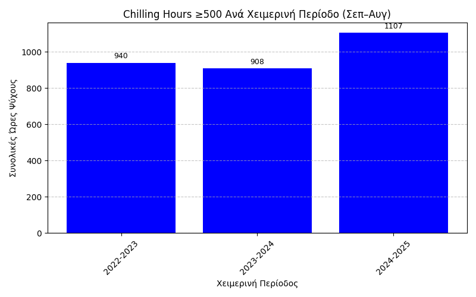
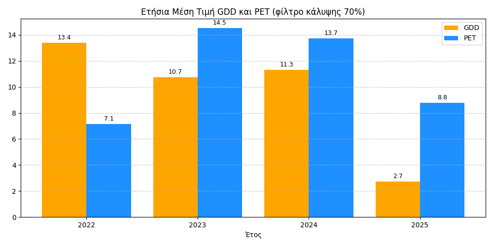

# Μετεωρολογία και Ψηφιακά Συστήματα
 Η παρούσα εργασία έχει ως στόχο τη μελέτη το καιρικών φαινομένων και πώς αυτές επιδρούν στις καλλιέργειες

 ## Πρωτογενης Τιμες
 
 
 
---
 ## 'Ωρες Ψύχους ανά μήνα
 Συνολικές ώρες ψύχους που παρατηρήθηκαν κατά τη διάρεκια του 2022-2025 
 
 

 ---
 ## Κατάλληλες Περίοδοι για Σπορά και Ψεκασμό

 ---
 ## Συσσώρευση Βλάστησης 
 
 

 ---
